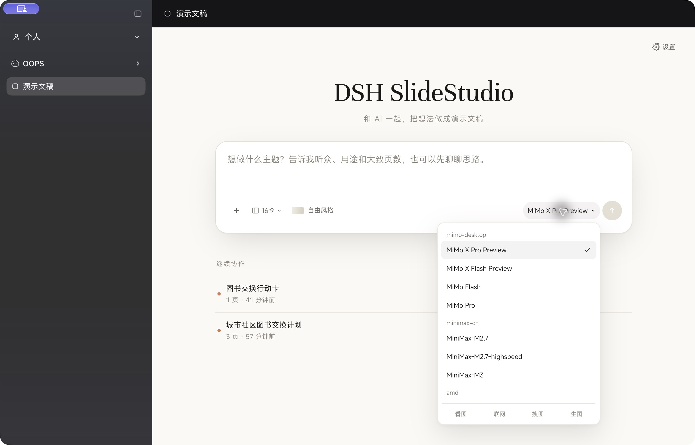
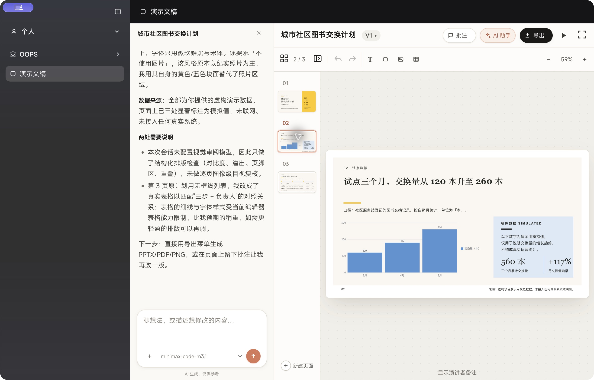
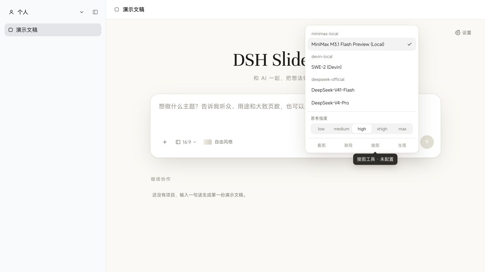
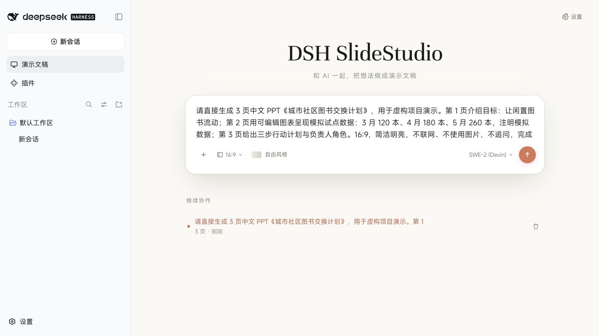
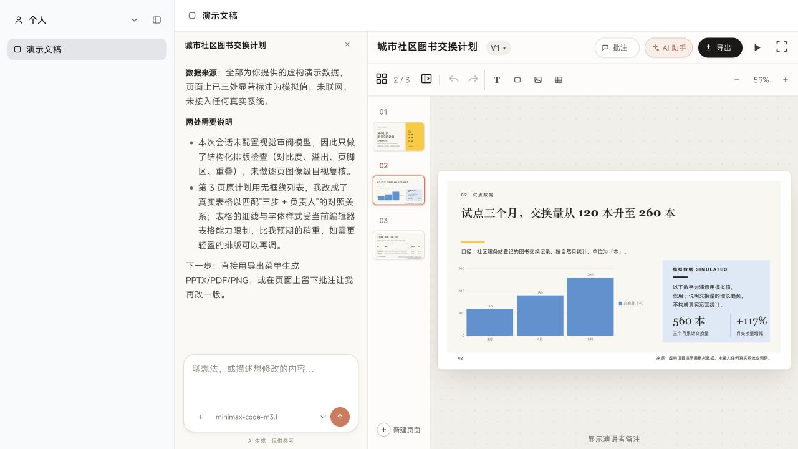
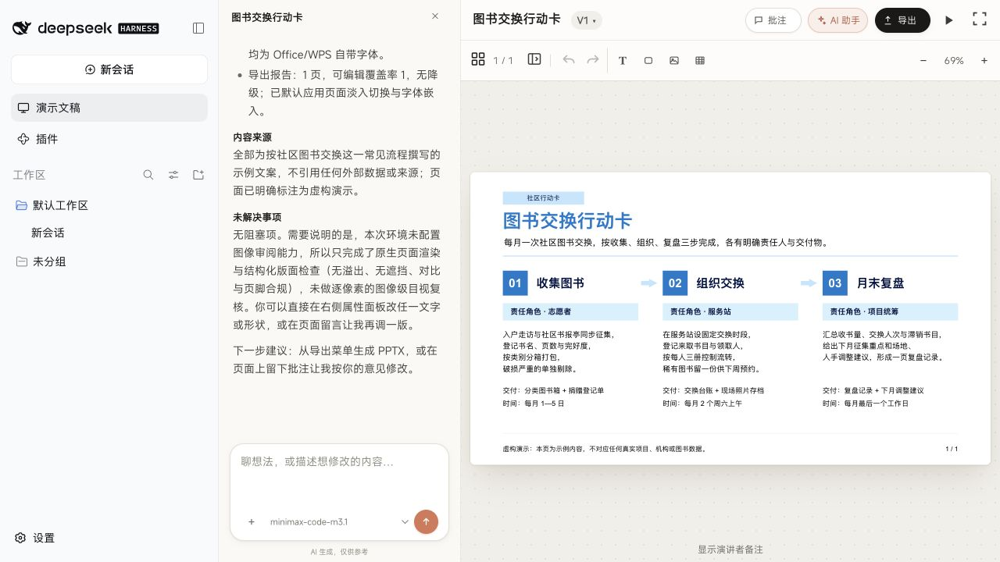
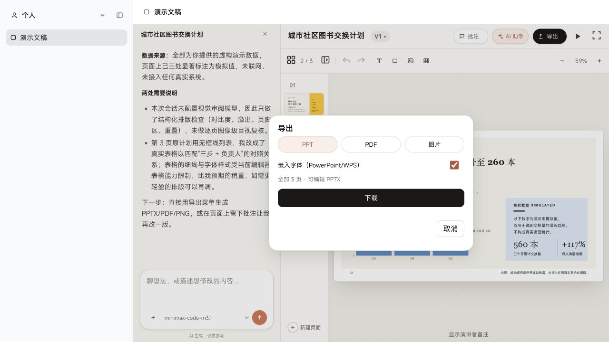
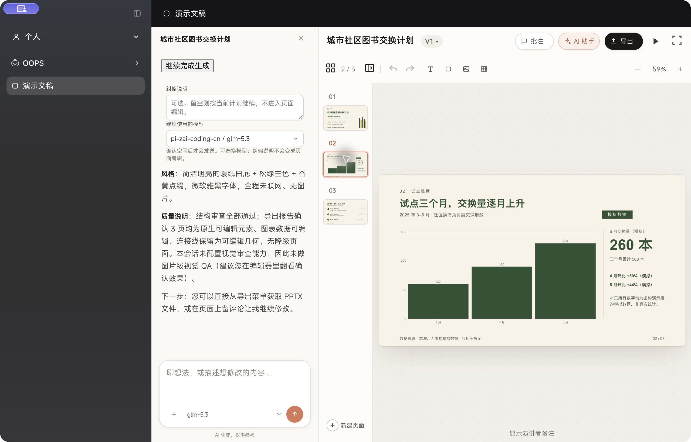
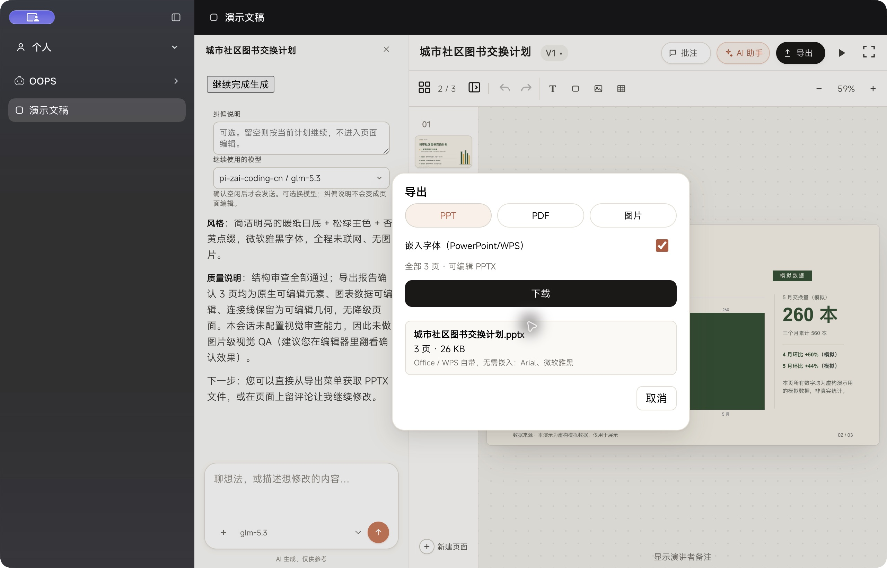

# Hosted model synchronization and local generation acceptance

## Problem and fix

The hosted plugin intersected a private `slides-model-catalog.json` / credential
store with the Harness adapter catalog. Native custom providers disappeared
unless separately imported. Generation also required duplicate credentials in
the isolated Slides home. The hosted path now reads every registered provider
and model directly from `ctx.llm`, invalidates its cache on
`llm/adapters-updated`, and lets the selected adapter resolve its credentials.
Unknown model IDs are still rejected. The standalone product retains its
isolated-home credential checks. Existing generation-route restrictions remain
in place; listing a model does not override them.

A provider call failure no longer removes its models from the hosted picker.
It remains listed with degraded status. The default health selection comes from
the same live roster as the picker.

Other observed fixes:

- Read the active `profileContext.home` when embedded in Harness.
- Locate checkout/design resources relative to installed modules, independently
  of the launch cwd; refresh palettes when the resource root changes.
- Make Personal optional in client metadata, matching the existing fallback UI.
- Declare the local package as a bundle so package installation activates it.
- Do not interpret `403` embedded in a provider trace ID as an HTTP auth error.

## Verification

DSH 0.2.0-rc.2, macOS; native Codex browser interaction and screenshots.
Two separate temporary Homes, one with Personal 0.2.7 and one without Personal.
After those generation tests, the user authorized a normal Desktop restart.
The installed plugin was then verified in the actual Desktop Personal UI.

| Check | Observed result |
| --- | --- |
| Personal entry | Loads the full editor and native custom model list |
| Independent sidebar entry | Loads without Personal; MiniMax completed and exported a separate 1-page action card |
| MiniMax M3.1 Flash Preview (`minimax-code-m3.1`) | Completed a 3-page Chinese deck and editable PPTX export |
| Editable content | Export report: 3 slides, native coverage 1, one native editable chart, no degradations |
| SWE-2 (`devin/swe-2`) | Selected successfully; PPT intent requests failed twice with upstream `invalid_argument` |
| SWE-2 minimal gateway request | HTTP 200 and `OK`; does not prove PPT generation works |
| Main Desktop activation | Passed after normal restart: official catalog 44, Slides catalog 44, 15 providers, missing 0, extra 0; existing MiniMax deck opened in Personal |

The MiniMax brief requested a fictional community book exchange plan, monthly
simulated values 120/180/260, three action steps, no web research or images.
The agent finished in approximately 6m24s from durable session creation to turn
completion. It produced a native chart and native table. No image-review model
was configured; there is no claimed automated visual-review pass. No reliable
billing total was supplied, so this is not a cost comparison or a broad model
benchmark.

PPTX SHA-256:
`6f054107f51eaa8f962a517a85e09d66749b06baaac045a947e4c9be4362e700`

## Actual Desktop verification

The current Host returned the same 44 provider/model identity pairs from
`session/modelCatalog` and `/slides/models`. This is a live catalog check,
not a claim that all 44 models passed generation. The screenshots below show
the installed Personal picker and the reopened MiniMax chart page.

## Screenshots

Personal and model discovery:

Independent entry with SWE-2 selected:

MiniMax chart in the actual editor:

MiniMax also completed a separate generation from the independent sidebar:

Three-page editable export:

## Automated checks and remaining boundaries

- `npm run test:dsh-contract`: bundle, Host and client tests pass, including hosted
  roster/health parity, unknown-model rejection, retained generation restrictions,
  and trace-ID error classification.
- Targeted theme-pack tests: 35 passed, including launch-cwd and cache-root changes.
- Full presentation-run suite: 271/272 passed. The unchanged catalog test expects
  the absent vendored `vendor/open-kimi-ppt/git-pre-wipe/theme.md` file.
- DSHX's whole-repository compatibility audit finds pre-existing legacy
  `assistant/chunk` handling/fixtures; full bounded server hot-reload acceptance
  is not claimed.

## GLM-5.3 on the actual Desktop

A further live run used the existing `pi-zai-coding-cn / glm-5.3` adapter
on the actual Desktop Host. It completed the same three-page Chinese community
book exchange brief. The operator clicked Export, Download, and the native Save
dialog. ZIP inspection of the downloaded PPTX found three slide XML parts and
one native chart part; size 26,930 bytes. SHA-256:
`75b7fd259e5a3f77f0b1c746e13bd94a6387b0bc67175129d3084e0829f7705f`.

The first native automation input dropped Chinese characters. That incomplete
request was stopped; the full Chinese brief was pasted, verified in the UI, and
submitted in the same test session. This was an operator-input correction, not
a clean one-shot model benchmark. The final generation completed without a
provider error. No automated vision review was configured.

## Space-switch investigation

A failed legacy `dsh-personal-slides` instance had been re-enabled alongside the
active `dsh-openslides` bundle. A fresh authenticated browser page failed to boot
and named the legacy instance. Disabling that exact legacy instance through the
official plugin manager immediately restored fresh-page loading. The active
bundle and project data were retained. This establishes a duplicate-plugin boot
defect; it does not establish that the same defect causes every switch stutter.

Source inspection found that Personal calls `layout.selectPanel(null)` to return
to Work. The shell selects a keyed main slot, and the renderer uses each entry's
identity as a React key. Thus switching spaces unmounts and remounts the main
panel. Personal also releases its sidebar override, remounting the Work sidebar.
Observed Desktop state contained 267 sessions (100 visible rows) and a selected
311-step conversation. Returning to Personal reset the Slides editor to its hub,
consistent with that lifecycle. The switch handler itself makes no model call.

Reconstruction of the sidebar and conversation is a plausible source of the
stutter. Native input/AX round-trip timings are not browser frame timings and
were not used to quantify performance. The browser permission prompt denied
CDP performance profiling, so no CPU/long-task trace was collected. The dominant
performance cause and a verified performance fix remain open; this report does
not attribute the stutter to the SWE proxy or declare it fixed.
