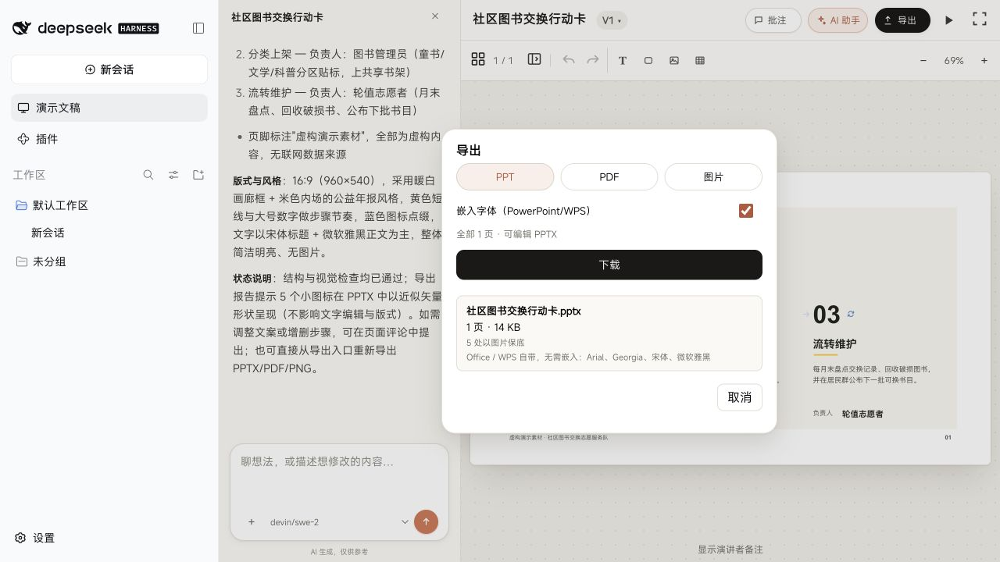
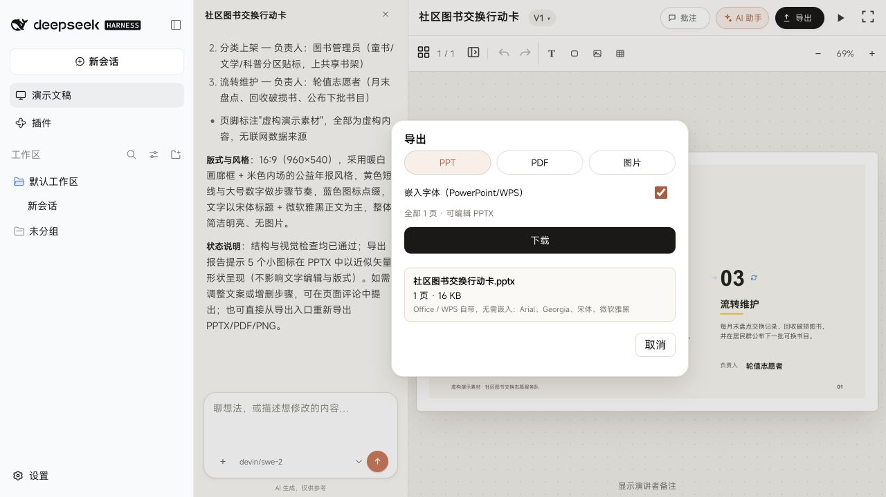
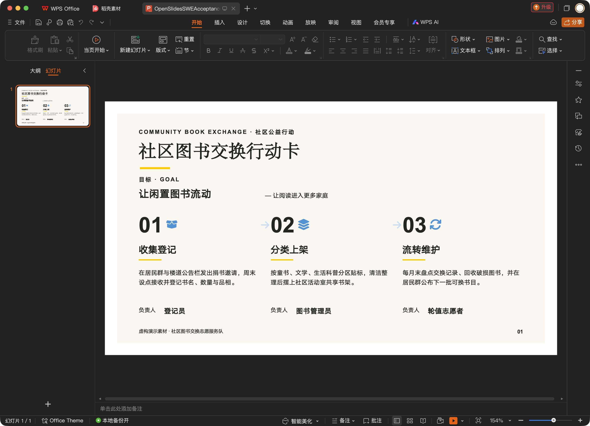
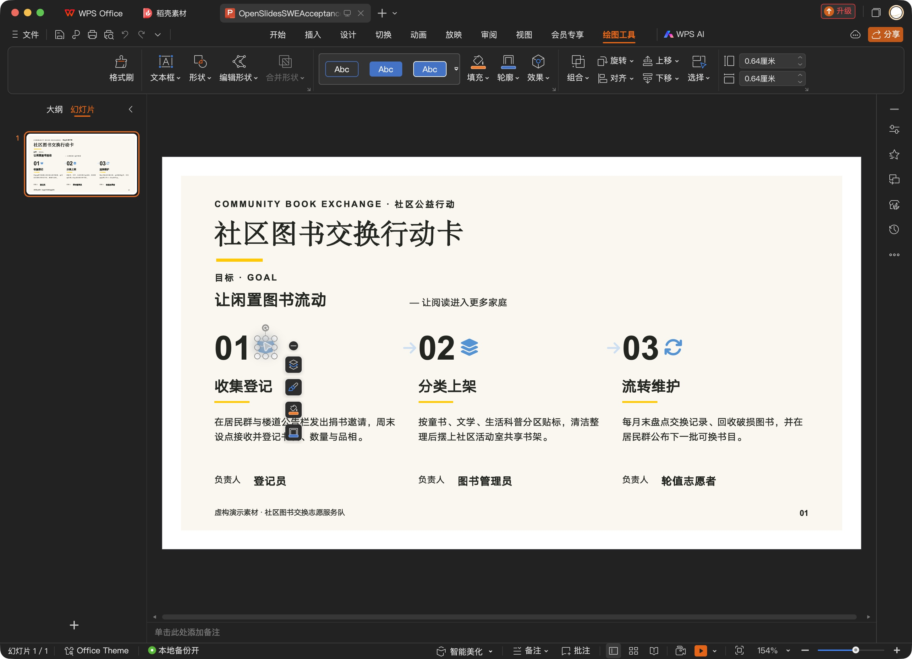

# Hosted model synchronization and local generation acceptance

## Current release: 0.2.0

The fixes below are distributed as the formal 0.2.0 release from `main`. Earlier pending/PR statements are dated investigation history. The package and client Loader ID are now both `dsh-openslides`, with an official `dsh.bundle.patch` and prebuilt code. npm name installation remains pending registry verification. The independent and Personal entry paths remain supported.

Personal 0.2.8 separately removes Work/sidebar and iframe remounts on ordinary space switches. Its offline lifecycle comparison and three actual Web round trips passed; see [the Personal report](https://github.com/aa2246740/dsh-personal-entry/blob/main/docs/switch-performance.md). Slides cooperates with its modal through `personal.suspend()` when opening Host Settings. This does not supply a real Desktop long-task trace.

Final archive Desktop interaction remains unverified because native automation returned stale/invalid UI elements, and then timed out. Existing Desktop generation and WPS evidence below applies only to the builds identified there. The external pinned browser runtime is still a prerequisite; installation does not download it. Windows/Linux native interactions and automatic project migration are not claimed.

## Earlier investigation and evidence

## Problem and fix

The hosted plugin intersected a private `slides-model-catalog.json` / credential
store with the Harness adapter catalog. Native custom providers disappeared
unless separately imported. Generation also required duplicate credentials in
the isolated Slides home. The hosted path now reads every registered provider
and model directly from `ctx.llm`, invalidates its cache on
`llm/adapters-updated`, and lets the selected adapter resolve its credentials.
Unknown model IDs are still rejected. The standalone product retains its
isolated-home credential checks. Existing generation-route restrictions remain
in place; listing a model does not override them.

A provider call failure no longer removes its models from the hosted picker.
It remains listed with degraded status. The default health selection comes from
the same live roster as the picker.

Other observed fixes:

- Read the active `profileContext.home` when embedded in Harness.
- Locate checkout/design resources relative to installed modules, independently
  of the launch cwd; refresh palettes when the resource root changes.
- Make Personal optional in client metadata, matching the existing fallback UI.
- Declare the local package as a bundle so package installation activates it.
- Do not interpret `403` embedded in a provider trace ID as an HTTP auth error.

## Verification

DSH 0.2.0-rc.2, macOS; native Codex browser interaction and screenshots.
Two separate temporary Homes, one with Personal 0.2.7 and one without Personal.
After those generation tests, the user authorized a normal Desktop restart.
The installed plugin was then verified in the actual Desktop Personal UI.

| Check | Observed result |
| --- | --- |
| Personal entry | Loads the full editor and native custom model list |
| Independent sidebar entry | Loads without Personal; MiniMax completed and exported a separate 1-page action card |
| MiniMax M3.1 Flash Preview (`minimax-code-m3.1`) | Completed a 3-page Chinese deck and editable PPTX export |
| Editable content | Export report: 3 slides, native coverage 1, one native editable chart, no degradations |
| SWE-2 (`devin/swe-2`) | Selected successfully; PPT intent requests failed twice with upstream `invalid_argument` |
| SWE-2 minimal gateway request | HTTP 200 and `OK`; does not prove PPT generation works |
| Main Desktop activation | Passed after normal restart: official catalog 44, Slides catalog 44, 15 providers, missing 0, extra 0; existing MiniMax deck opened in Personal |

The MiniMax brief requested a fictional community book exchange plan, monthly
simulated values 120/180/260, three action steps, no web research or images.
The agent finished in approximately 6m24s from durable session creation to turn
completion. It produced a native chart and native table. No image-review model
was configured; there is no claimed automated visual-review pass. No reliable
billing total was supplied, so this is not a cost comparison or a broad model
benchmark.

PPTX SHA-256:
`6f054107f51eaa8f962a517a85e09d66749b06baaac045a947e4c9be4362e700`

## Actual Desktop verification

The current Host returned the same 44 provider/model identity pairs from
`session/modelCatalog` and `/slides/models`. This is a live catalog check,
not a claim that all 44 models passed generation. The screenshots below show
the installed Personal picker and the reopened MiniMax chart page.

## Screenshots

Personal and model discovery:

Independent entry with SWE-2 selected:

MiniMax chart in the actual editor:

MiniMax also completed a separate generation from the independent sidebar:

Three-page editable export:

## Automated checks and remaining boundaries

- `npm run test:dsh-contract`: bundle, Host and client tests pass, including hosted
  roster/health parity, unknown-model rejection, retained generation restrictions,
  and trace-ID error classification.
- Targeted theme-pack tests: 35 passed, including launch-cwd and cache-root changes.
- Full presentation-run suite: 271/272 passed. The unchanged catalog test expects
  the absent vendored `vendor/open-kimi-ppt/git-pre-wipe/theme.md` file.
- DSHX's whole-repository compatibility audit finds pre-existing legacy
  `assistant/chunk` handling/fixtures; full bounded server hot-reload acceptance
  is not claimed.

## GLM-5.3 on the actual Desktop

A further live run used the existing `pi-zai-coding-cn / glm-5.3` adapter
on the actual Desktop Host. It completed the same three-page Chinese community
book exchange brief. The operator clicked Export, Download, and the native Save
dialog. ZIP inspection of the downloaded PPTX found three slide XML parts and
one native chart part; size 26,930 bytes. SHA-256:
`75b7fd259e5a3f77f0b1c746e13bd94a6387b0bc67175129d3084e0829f7705f`.

The first native automation input dropped Chinese characters. That incomplete
request was stopped; the full Chinese brief was pasted, verified in the UI, and
submitted in the same test session. This was an operator-input correction, not
a clean one-shot model benchmark. The final generation completed without a
provider error. No automated vision review was configured.

## Space-switch investigation

A failed legacy `dsh-personal-slides` instance had been re-enabled alongside the
active `dsh-openslides` bundle. A fresh authenticated browser page failed to boot
and named the legacy instance. Disabling that exact legacy instance through the
official plugin manager immediately restored fresh-page loading. The active
bundle and project data were retained. This establishes a duplicate-plugin boot
defect; it does not establish that the same defect causes every switch stutter.

Source inspection found that Personal calls `layout.selectPanel(null)` to return
to Work. The shell selects a keyed main slot, and the renderer uses each entry's
identity as a React key. Thus switching spaces unmounts and remounts the main
panel. Personal also releases its sidebar override, remounting the Work sidebar.
Observed Desktop state contained 267 sessions (100 visible rows) and a selected
311-step conversation. Returning to Personal reset the Slides editor to its hub,
consistent with that lifecycle. The switch handler itself makes no model call.

Reconstruction of the sidebar and conversation is a plausible source of the
stutter. Native input/AX round-trip timings are not browser frame timings and
were not used to quantify performance. The browser permission prompt denied
CDP performance profiling, so no CPU/long-task trace was collected. The dominant
performance cause and a verified performance fix remain open; this report does
not attribute the stutter to the SWE proxy or declare it fixed.

## Release preparation (not a release approval)

The PR now incorporates the newer `main` packaging work. The source/build
conflicts were resolved while retaining module-relative resource discovery.
The release archive is verified outside the checkout before the builder reports
success: all production dependency paths must stay inside the extracted package,
only official Harness peers are supplied externally, the real produce gates run,
and an eight-page fixture is exported to PPTX. The current verifier passes with
104 dependency package instances. Browser rendering uses the separately managed
pinned runtime; this package does not install or copy a browser.

The old archive retained a local `link:` dependency and omitted transitive
packages. Packaging now records ordinary version dependencies and includes their
production closure. Internal workspace packages remain siblings because the
runtime's integrity checks read their adjacent compiled files. A first isolated
candidate exposed that sibling-layout requirement; it was fixed before the
successful archive verification. The existing v0.1.0 Release has not been
replaced, and the corrected local candidate is not yet an approved release.

The catalog test now reads `theme.md` from the retained 1.2.0 source pack,
while continuing to verify all 44 preview-to-guide mappings. The previous
`git-pre-wipe` directory retains image resources but not the index.

Validation: `npm run test:native` passed 1,122/1,122; `test:dsh-contract` passed
322/322; the presentation-run subset passed 272/272; tracked-file secret scan
passed (2,453 files, six pattern checks).

A bounded SWE proxy comparison returned HTTP 200 without explicit sampling
parameters, HTTP 502 `invalid_argument` with only `temperature: 0`, and HTTP 200
with only `max_tokens: 512` after the proxy recovered. The classifier no longer
forces temperature; it retains time/token bounds and schema/authorization
validation. The corrected extracted plugin passed classification and started
actual page generation with SWE-2. This is not yet a claim of complete SWE
PPTX delivery. Live performance profiling remains unapproved, and the space
switch stutter remains an open release gate.

## October 3: SWE delivery and final-package defects

SWE-2 completed the fictional one-page community book-exchange deck in the
extracted plugin, with ten layout revisions and a model visual-review pass.
The authoritative top-level execution state reported delivered, with no blockers.
This was a corrected run after the earlier parameter failures, not a clean
first-attempt model benchmark.

Actual delivery exposed a content fidelity bug: five Font Awesome icons were
silently replaced by five-point stars. The export dialog misleadingly called
all degradations image fallbacks. The exporter now reads the same bundled solid,
regular and brand fonts as the editor and emits native editable custom geometry,
including quadratic curves. Unknown icons fail export rather than change their
meaning. The UI now describes the general count as export differences.

The final-package reopen flow also exposed missing presetShapeDefinitions.xml.
Both runtime package locations now include the geometry data; archive verification
exercises shape geometry and editable icon export in addition to the eight-page
fixture and dependency checks.

Validation after these changes: exporter tests 49/49; actual archive verification
passes with 104 dependency instances, eight-page export and editable icon checks.
The temporary Web Host was restarted on the corrected extracted archive, the
existing SWE deck reopened successfully, and its PPTX was downloaded through the
native browser. The downloaded file contains five editable icon objects and zero
star replacements: 16,583 bytes, SHA-256
`864a48bec5f9a39e8bacc4182d8c250e0d71569a0c127578106ca8b700f59001`.
The exporter report has nativeCoverage 1 and no degradations. The earlier
1,122-test full-suite result precedes this icon change; only the affected exporter
suite and archive checks were rerun. PowerPoint/WPS visual opening is not yet proved.

Release remains pending: the final archive still needs actual Desktop acceptance,
and Personal-to-Work stutter has no confirmed dominant cause or verified fix.
The previously denied raw browser profiling request remains pending renewed
permission. This PR has not been merged and no new stable release was published.

## October 3: native WPS acceptance

Opened a byte-identical copy of the downloaded SWE-2 PPTX in the local WPS
application. The complete page renders with the original box, arrow, layer and
rotation icons. Selecting the box exposes native drawing tools and resize/rotate
handles. This closes the WPS opening and editable-icon visual checks for this
artifact; Microsoft PowerPoint itself was not tested. Native automation briefly
lost its connection during opening, then recovered; the loaded document and
editable shape were inspected directly rather than inferring success from the
open command.

A fresh local Desktop read still reports 44 official models and 44 Slides models,
with no missing or extra entries. Personal and the existing GLM deck reopen.
These observations apply to the installed development wrapper; they do not close
final-package Desktop activation acceptance.

Source inspection confirms the Personal exit calls layout.selectPanel(null),
releases Personal's sidebar/leading slot contributions, and switches the keyed
main slot back to conversation. Slides' iframe is inside the unmounted panel.
There is no SWE generation call in the switch handler. This establishes the
lifecycle path, not a measured dominant cause of the stutter. Raw CDP remains
blocked by the browser's saved site setting even after renewed chat consent;
no alternate profiling channel was used. The PR remains unmerged.

## 0.2.0 packaging and installation verification

The actual prebuilt tarball passed official DSH CLI installation into two fresh, temporary Homes: Slides alone, and Personal 0.2.8 plus Slides. Both selected the expected bundle and produced a valid official configuration dump. Package name, patch module name, and compiled client Loader ID all equal `dsh-openslides`. These checks establish installation and composition, not final Desktop UI acceptance. Two compiled-client Settings lifecycle tests pass with and without Personal; Personal's final build also passes its offline suspend/resume and iframe-preservation check.

The archive passes 104 production dependency checks, real produce gates, an eight-page PPTX export, shape geometry loading and two editable-icon exports outside the checkout. See [release-install.json](release-install.json). The npm registry is still awaiting account authentication; name-only installation is not yet reported as published.
